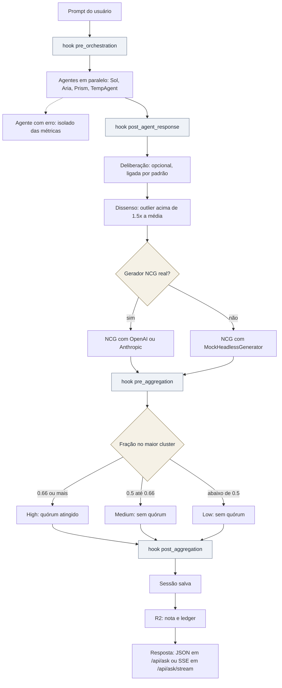
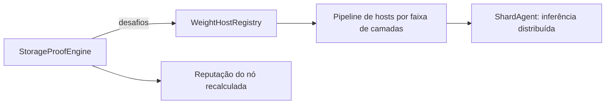
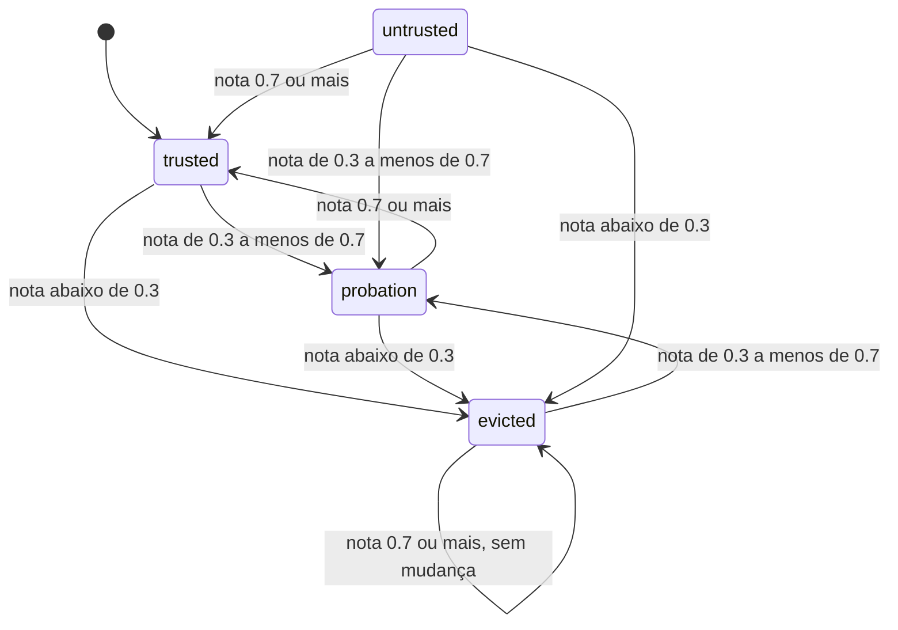

# Maestro-Orchestrator: visão geral

Versão do código: 7.4.0 (`../maestro/__init__.py`). Este documento é um resumo em português, conferido contra o código. Onde não foi possível conferir, está marcado como "não verificado".

## O que é

O Maestro-Orchestrator envia a mesma pergunta a vários modelos de IA, compara as respostas e só chama de consenso o que passa por um quórum. A tese central (veja `../ARCHITECTURE.md`) é que a consulta viaja até os pesos persistentes, e não o contrário: nenhum modelo sozinho decide a verdade, e o que é aprendido volta para a camada de reflexão (R2, MAGI, NCG).

## Fluxo de uma pergunta

O fluxo está em `run_orchestration_async` (`../maestro/orchestrator.py:59`). Os hooks de plugin só rodam quando há um `mod_manager`:

1. Hook `pre_orchestration` (pode trocar prompt e agentes).
2. Consulta paralela com `asyncio.gather(..., return_exceptions=True)`: um agente com erro vira resposta de falha e fica fora das métricas, sem derrubar os demais. Depois, hook `post_agent_response` por agente.
3. Deliberação (ligada por padrão, 1 rodada): cada agente lê as respostas dos pares e refina a sua (`../maestro/deliberation.py`).
4. Dissenso: distâncias semânticas entre pares, perfis por agente e outliers (`../maestro/dissent.py`).
5. NCG: linha de base de um gerador "headless" para detectar deriva e colapso silencioso (`../maestro/ncg/`).
6. Hook `pre_aggregation`, agregação e quórum (`../maestro/aggregator.py`), hook `post_aggregation`.
7. Salvamento da sessão (hooks `pre_session_save` e `post_session_save`) e depois R2: nota, sinais de melhoria e ledger (`../maestro/r2.py`, hooks `pre_r2_scoring` e `post_r2_scoring`).

A rota `/api/ask` devolve JSON. A `/api/ask/stream` usa `run_orchestration_stream` (`../maestro/orchestrator.py:376`): mesma ordem, eventos SSE por etapa e cada agente entregue assim que responde. O streaming tem o mesmo fallback do NCG (`../maestro/orchestrator.py:554`).

O conselho padrão (backend, CLI e TUI) tem os quatro agentes acima. O `ShardAgent` existe, mas nenhum desses pontos o instancia.

Agentes e modelos (campo `model` em `../maestro/agents/*.py`):

| Agente | Modelo |
|---|---|
| Aria | `claude-sonnet-4-6` |
| Sol | `gpt-4o` |
| Prism | `models/gemini-2.5-flash` |
| TempAgent | `meta-llama/llama-3.3-70b-instruct` |
| ShardAgent | `distributed` (inferência pela rede de weight hosts, `../maestro/agents/shard.py`) |

## Limiares reais

| Valor | Onde |
|---|---|
| `QUORUM_THRESHOLD = 0.66` | `../maestro/aggregator.py:3` |
| `SIMILARITY_THRESHOLD = 0.5` (distância entre pares abaixo disso = "de acordo") | `../maestro/aggregator.py:4` |
| Confiança Medium quando `agreement_ratio >= 0.5` (abaixo de 0.66); abaixo disso, Low | `../maestro/aggregator.py:87` |
| Outlier: distância média acima de 1.5x a média do grupo (mínimo 3 agentes) | `../maestro/dissent.py:145` |
| Reputação de nó: `PROBATION_THRESHOLD = 0.7`, `EVICTION_THRESHOLD = 0.3` | `../maestro/storage_proof.py:110-111` |
| Fórmula: `0.7 * challenge_pass_rate + 0.3 * mean_r2_contribution` (últimas 20 notas R2; neutro 0.5 se não há) | `../maestro/storage_proof.py:275` |
| `weight_locality_score`: warm com afinidade 1.0; warm 0.75; cold com afinidade 0.5; cold 0.25 | `../maestro/shard_registry.py:70` |

Na rede de pesos, `WeightHostRegistry.build_inference_pipeline` (`../maestro/shard_registry.py:234`) monta uma lista ordenada de hosts que cobre todas as camadas do modelo. O `StorageProofEngine` (`../maestro/storage_proof.py:95`) desafia os nós e recalcula a reputação (`../maestro/storage_proof.py:286`):

Transições de status a cada recálculo (`../maestro/storage_proof.py:285-292`; estado inicial `trusted` em `../maestro/storage_proof.py:92`):

Um nó `evicted` com nota 0.7 ou mais continua `evicted`: a promoção a `trusted` só vale para quem está em `probation` ou `untrusted`. Por isso um nó expulso só se recupera passando antes por `probation`. Nenhum código em `../maestro/` atribui `untrusted` (o valor aparece só no comentário da linha 92 e no teste da linha 291). `evict_if_necessary` (`../maestro/storage_proof.py:344-351`) também expulsa abaixo de 0.3.

Mudar limiares de consenso ou de storage proof exige aprovação humana. Nenhuma ferramenta impõe as camadas do projeto: são convenção.

## Componentes

| Componente | Papel | Código |
|---|---|---|
| Consenso | Orquestração, quórum, deliberação, dissenso, sessão, R2, NCG | `../maestro/orchestrator.py`, `aggregator.py`, `deliberation.py`, `dissent.py`, `r2.py`, `ncg/` |
| Auto-melhoria e MAGI | Introspecção, propostas, validação, injeção, guard, rollback. A injeção automática fica desligada por padrão: só liga com `MAESTRO_AUTO_INJECT` verdadeiro ou com a configuração do guard | `../maestro/self_improve.py`, `magi.py`, `injection_guard.py`, `applicator.py`, `rollback.py` |
| Rede de storage | Proof-of-storage, shards, node server, descoberta na LAN, cluster, instâncias Docker | `../maestro/storage_proof.py`, `shard_*.py`, `node_server.py`, `lan_discovery.py`, `cluster.py`, `instances.py` |
| Plataforma | Backend FastAPI, TUI Textual, CLI, chaves de API, Mod Manager (plugins), auto-updater | `../backend/`, `../maestro/tui/`, `../maestro/cli.py`, `../maestro/plugins/`, `../maestro/updater.py` |
| Frontend | Web UI React + Vite, servida pelo FastAPI a partir de `dist` | `../frontend/`, `../backend/main.py:163-167` |
| MaestrOS | Workspace Rust v0.0.1, só esqueleto, ao lado do Python (não o substitui; o papel final está em aberto) | `../maestros/` |

## Como rodar e testar

- `../entrypoint.py` escolhe a interface por `MAESTRO_MODE=web|cli|tui`; sem a variável, mostra um diálogo.
- Docker: `make up` (`docker compose up -d --build`). A porta do host vem de `MAESTRO_PORT` (padrão 8000, em `../docker-compose.yml`). A mensagem do Makefile cita sempre `localhost:8000`.
- TUI direto: `python -m maestro.tui`. CLI: `python -m maestro.cli`.
- Testes: `pytest tests/` é o gate declarado pelo dono. Não há CI nem comando de teste no Makefile, e este documento não afirma que a suíte está verde (não executada).

## Divergências entre docs e código

- NCG com gerador falso. `run_orchestration_async` usa `headless_generator or MockHeadlessGenerator()` (`../maestro/orchestrator.py:215`; a docstring diz o mesmo nas linhas 96-97). A detecção de colapso só é real quando um gerador real é passado. Backend, CLI e TUI escolhem um por chave de API (`../backend/orchestrator_foundry.py:42`: OpenAI, depois Anthropic); sem nenhuma chave, o NCG roda com o mock. Chamar a função direto, sem gerador, também.
- Frontend: `../backend/main.py:163-167` monta `backend/frontend/dist`, que só existe na imagem Docker (o Dockerfile copia para lá). Em desenvolvimento local, sem esse diretório, o backend roda só como API.
- Porta: a mensagem de `make up` fixa 8000 mesmo que `MAESTRO_PORT` mude.
- `../docs/architecture.md:18` chama o quórum de "66% similarity threshold", mas são dois valores distintos: 0.66 é a fração de agentes no maior cluster (`QUORUM_THRESHOLD`) e 0.5 é a distância máxima entre pares (`SIMILARITY_THRESHOLD`). O `quorum_logic.md` descreve corretamente.
- `HANDSHAKE_TIMEOUT` (5.0) da descoberta na LAN não tem teste (`../maestro/lan_discovery.py`); o valor documentado não prova o comportamento.
- Não verificado: comportamento em execução de qualquer rota ou interface; só código e docs foram lidos.
